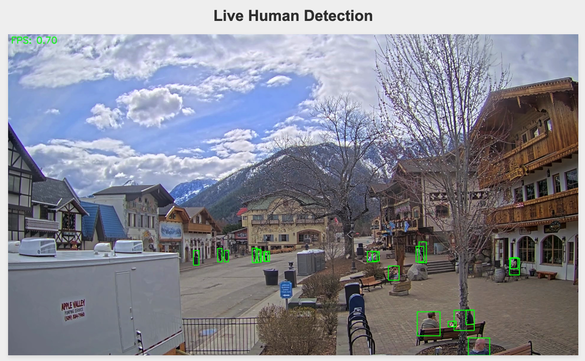
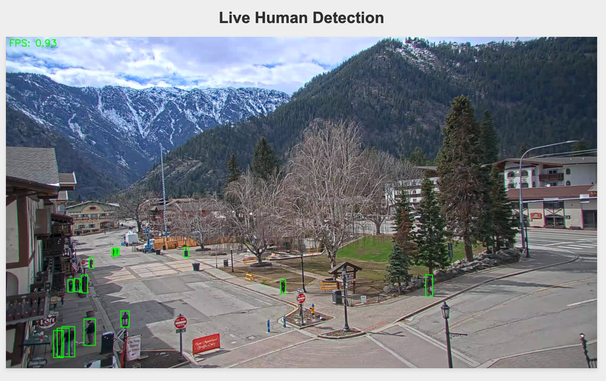

# YouTube Live Webcam Human Detector

This project watches a YouTube live stream (webcam) and detects humans in real-time, drawing bounding boxes around them and saving the processed frames as images. It also provides a web interface to view the processed stream in real-time.

**I'm just doing this for fun. This is not for any other use.**

## Screenshot




## Installation

### Option 1: Local Installation

1. Clone this repository
2. Install the required packages:

```bash
pip install -r requirements.txt
```

3. Make sure you have FFmpeg installed on your system
4. Set up your environment configuration:

```bash
cp .env.example .env
```

5. Edit the `.env` file with your preferred settings:

```
YOUTUBE_URL=https://www.youtube.com/watch?v=your_youtube_video_id
```

### Option 2: Docker Installation

1. Make sure you have Docker and Docker Compose installed on your system
2. Set up your environment configuration:

```bash
cp .env.example .env
```

3. Edit the `.env` file with your YouTube URL
4. Build and run the container:

```bash
docker compose up --build
```

## Usage

### Local Usage

Run the script:

```bash
python live_human_detector.py
```

The script will automatically:
- Connect to the YouTube stream specified in your .env file
- Process the video frames
- Detect and mark humans with bounding boxes
- Save the processed video to the `output` folder
- Start a web server at http://localhost:5005

### Docker Usage

Start the container:

```bash
docker compose up
```

To stop the container:

```bash
docker compose down
```

### Viewing the Live Stream

Once the application is running, open a web browser and navigate to:

```
http://localhost:5005
```

You'll see the live stream with bounding boxes drawn around detected humans.

## Configuration

The following environment variables can be set in the `.env` file:

| Variable | Description | Default |
|----------|-------------|---------|
| YOUTUBE_URL | URL of the YouTube live stream to process | https://www.youtube.com/watch?v=your_youtube_video_id |
| CONFIDENCE_THRESHOLD | Minimum confidence level (0-1) for human detection | 0.5 |
| SAVE_OUTPUT | Whether to save the processed video to disk | true |

## Output

The processed frames are saved to timestamped directories in the `output` folder:

```
output/session_20230815_143027/
  ├── frame_000001.jpg
  ├── frame_000002.jpg
  ├── frame_000003.jpg
  └── ...
```

Frames are saved in the following cases:
- When humans are detected in the frame
- Periodically (every 5 seconds) to maintain context

Each saved frame includes:
- Bounding boxes around detected humans
- The current FPS calculation
- A timestamp showing when the frame was captured

## Requirements

- Python 3.7+
- OpenCV
- PyTorch
- yt-dlp (YouTube downloader)
- FFmpeg (for video processing)
- Flask (for web interface)

## Docker Requirements

- Docker
- Docker Compose

## Note

This application uses a pre-trained Faster R-CNN model from PyTorch for human detection. 
The model is optimized for detecting people in various contexts.

## License

This project is licensed under the MIT License - see the [LICENSE](LICENSE.md) file for details.

## Disclaimer

**IMPORTANT: This software is provided for educational and research purposes only.**

- This project is designed for analyzing publicly available streams only.
- Always respect privacy and copyright laws in your jurisdiction.
- Do not use this software for surveillance or to violate anyone's privacy.
- The authors and contributors are not responsible for any misuse of this software.